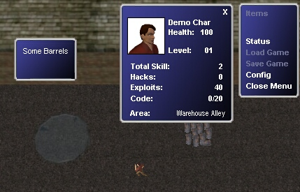



## RPG Game \(Hacker\)

### Description

This code demonstrates walking around in a virtual environment, collision detection, animation, sounds etc. It is actually a game Ive been working on for a few days. There are menus, sounds, graphics etc! looks like final fantasy!
 
### More Info
 
Windows ME may not play sounds, Teh character is not controlable in windows 95B

             |
---                |---
**Submitted On**   |2001-05-20 17:34:56
**By**             |[Tecc](https://github.com/Planet-Source-Code/PSCIndex/blob/master/ByAuthor/tecc.md)
**Level**          |Beginner
**User Rating**    |4.6 (41 globes from 9 users)
**Compatibility**  |VB 6\.0
**Category**       |[Games](https://github.com/Planet-Source-Code/PSCIndex/blob/master/ByCategory/games__1-38.md)
**World**          |[Visual Basic](https://github.com/Planet-Source-Code/PSCIndex/blob/master/ByWorld/visual-basic.md)
**Archive File**   |[RPG Game \(198315202001\.zip](https://github.com/Planet-Source-Code/tecc-rpg-game-hacker__1-23310/archive/master.zip)

